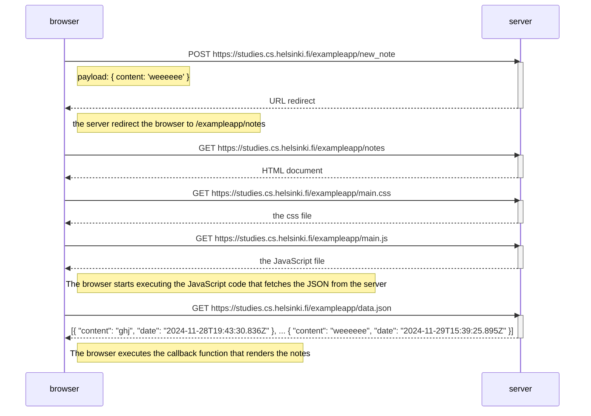

```mermaid
sequenceDiagram
    participant browser
    participant server

    browser->>server: POST https://studies.cs.helsinki.fi/exampleapp/new_note

    activate server
    Note right of browser: payload: { content: 'weeeeee' }
    server-->>browser: URL redirect
    deactivate server

    Note right of browser: the server redirect the browser to /exampleapp/notes

    browser->>server: GET https://studies.cs.helsinki.fi/exampleapp/notes
    activate server
    server-->>browser: HTML document
    deactivate server

    browser->>server: GET https://studies.cs.helsinki.fi/exampleapp/main.css
    activate server
    server-->>browser: the css file
    deactivate server

    browser->>server: GET https://studies.cs.helsinki.fi/exampleapp/main.js
    activate server
    server-->>browser: the JavaScript file
    deactivate server

    Note right of browser: The browser starts executing the JavaScript code that fetches the JSON from the server

    browser->>server: GET https://studies.cs.helsinki.fi/exampleapp/data.json
    activate server
    server-->>browser: [{ "content": "ghj", "date": "2024-11-28T19:43:30.836Z" }, ... { "content": "weeeeee", "date": "2024-11-29T15:39:25.895Z" }]
    deactivate server

    Note right of browser: The browser executes the callback function that renders the notes
```