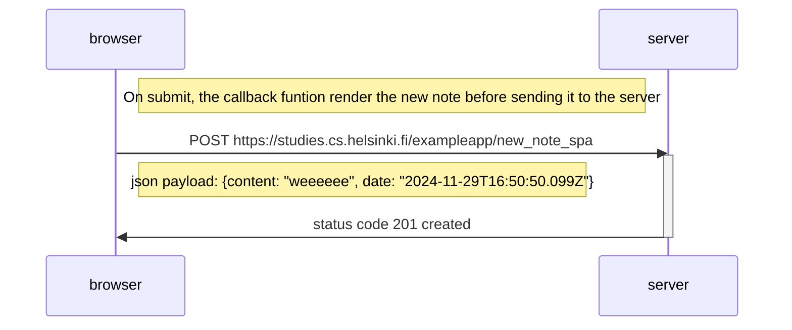

```mermaid
sequenceDiagram
    participant browser
    participant server

    Note right of browser: On submit, the callback funtion render the new note before sending it to the server

    browser->>server: POST https://studies.cs.helsinki.fi/exampleapp/new_note_spa
    activate server
    Note right of browser: json payload: {content: "weeeeee", date: "2024-11-29T16:50:50.099Z"}
    server->>browser: status code 201 created
    deactivate server
```